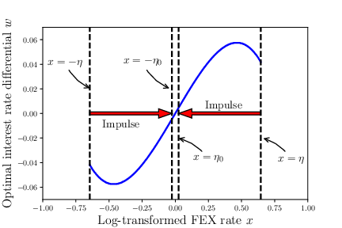
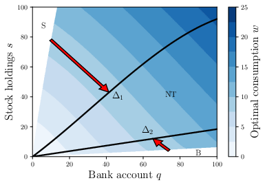
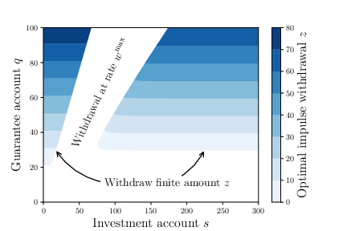

<p align="center">
  
</p>

<a href="https://github.com/parsiad/QuantPDE"></a>

A high-performance, open-source, header-only C++(>=11) library for pricing derivatives.

More generally, QuantPDE can also be used to solve [Hamilton-Jacobi-Bellman](https://en.wikipedia.org/wiki/Hamilton%E2%80%93Jacobi%E2%80%93Bellman_equation) (HJB) equations and quasi-variational inequalities (HJBQVI).

# Table of contents

* [Examples](#examples)
  * [Derivative pricing](#derivative-pricing)
  * [HJBQVI](#hjbqvi)
* [Install](#install)
  * [Ubuntu](#ubuntu)
  * [OS X with Homebrew](#os-x-with-homebrew)
* [Tutorial](#tutorial)
* [Citation](#citation)

# Examples

In addition to the [tutorial](#tutorial), several examples can be found in the ```examples``` directory bundled with QuantPDE.
They are described below.

## Derivative pricing

[European call with jumps](https://github.com/parsiad/QuantPDE/blob/master/examples/jump_diffusion.cpp)

[Unequal borrowing/lending rates in a European straddle option](https://github.com/parsiad/QuantPDE/blob/master/examples/unequal_borrowing_lending_rates.cpp)

[A convergence table for European/American (digital or nondigital) puts/calls](https://github.com/parsiad/QuantPDE/blob/master/examples/vanilla_options.cpp)

> **Technical note:** The jump-diffusion in the library used in example (1) uses an explicit evaluation of the correlation integral appearing in the partial integro-differential equation (PIDE) via the method described in  _d'Halluin, Yann, Peter A. Forsyth, and Kenneth R. Vetzal. "Robust numerical methods for contingent claims under jump diffusion processes." IMA Journal of Numerical Analysis 25.1 (2005): 87-112_.

> **Technical note:** The American option valuation technique used in example (3) uses the penalty method described in _d’Halluin, Yann, Peter A. Forsyth, and George Labahn. "A penalty method for American options with jump diffusion processes." Numerische Mathematik 97.2 (2004): 321-352_.

## HJBQVI

If you are interested in solving HJBQVI equations, I recommend reading the code in one of the examples below while cross-referencing the original paper the corresponding problem was introduced in.

[Optimal combined control of the exchange rate](https://github.com/parsiad/QuantPDE/blob/master/examples/hjbqvi/exchange_rate.cpp) as formulated in Mundaca, Gabriela, and Bernt Øksendal. "Optimal stochastic intervention control with application to the exchange rate." Journal of Mathematical Economics 29.2 (1998): 225-243.



[Optimal consumption subject to fixed and proportional transaction costs](https://github.com/parsiad/QuantPDE/blob/master/examples/hjbqvi/optimal_consumption.cpp) as formulated in Chancelier, Jean-Philippe, Bernt Øksendal, and Agnès Sulem. "Combined stochastic control and optimal stopping, and application to numerical approximation of combined stochastic and impulse control." Proceedings of the Steklov Institute of Mathematics. VA Steklov. 237.0 (2002): 149-172.



[Guaranteed minimum withdrawal benefits in variable annuities](https://github.com/parsiad/QuantPDE/blob/master/examples/hjbqvi/gmwb.cpp) as introduced in Dai, Min, Yue Kuen Kwok, and Jianping Zong. "Guaranteed minimum withdrawal benefit in variable annuities." Mathematical Finance 18.4 (2008): 595-611 and reformulated in Chen, Zhuliang, and Peter A. Forsyth. "A numerical scheme for the impulse control formulation for pricing variable annuities with a guaranteed minimum withdrawal benefit (GMWB)." Numerische Mathematik 109.4 (2008): 535-569.



# Install

## Ubuntu

First, install **CMake** and **Eigen3**:

```bash
sudo apt-get install cmake libeigen3-dev
```

Some of the examples require **JsonCpp** (this step is only required if you wish to compile those examples):

```bash
sudo apt-get install libjsoncpp-dev
```

Then, simply run the following commands:

```bash
git clone https://github.com/parsiad/QuantPDE.git
cd QuantPDE
cmake .
sudo make install  # to install the library into system directories
make  # to compile the examples
```

The compiled examples will appear in the `bin` directory.

## OS X with Homebrew

If you do not already have Homebrew, you can install it by following [the instructions on their website](http://brew.sh/).

First, install **CMake** and **Eigen3**:

```bash
brew install cmake
brew install eigen
```

Some of the examples require **JsonCpp** (this step is only required if you wish to compile those examples):

```bash
brew install jsoncpp
```

Then, simply run the following commands:

```bash
git clone https://github.com/parsiad/QuantPDE.git
cd QuantPDE
cmake .
sudo make install  # to install the library into system directories
make  # to compile the examples
```

The compiled examples will appear in the `bin` directory.

# Tutorial

> **Notes:** If you are looking to launch your first application using QuantPDE as quickly as possible, try reading this tutorial once omitting any text seen in this typeface, while simultaneously implementing the application using the code provided.
> Come back and read these blurbs when you feel ready!

In this tutorial, we price a Bermudan put with a **local volatility function**.
A Bermudan option is one that gives its holder **the right to exercise a finite number of times** (the name is a pun: Bermuda, a British overseas territory, is somewhat American and somewhat European).
The [code for this tutorial](https://github.com/parsiad/QuantPDE/blob/master/examples/tutorial.cpp) is available in the examples directory.

## Including QuantPDE

The first thing we do is include QuantPDE and the associated modules that we are going to use.
We also include a few other things from the standard library (namespace `std`) to be used in the tutorial.

```cpp
#include <QuantPDE/Core>
#include <QuantPDE/Modules/Operators>

using namespace QuantPDE;
using namespace QuantPDE::Modules;

#include <algorithm> // std::max
#include <iostream>  // std::cout, std::endl

using namespace std;
```

To take advantage of as much compile-time auto-vectorization as possible, the Core and Modules routines are not compiled into objects (and hence there is nothing to link to!).

## Creating a spatial grid

Next, we create a spatial grid upon which the PDE is solved.
We create a grid that places many nodes around the strike price ```K = 100```.

```cpp
// Strike price
const Real K = 100.;

// Hand-picked grid (this is generally not a robust approach)
RectilinearGrid1 grid(
	Axis {
		0., 10., 20., 30., 40., 50., 60., 70.,
		75., 80.,
		84., 88., 92.,
		94., 96., 98., 100., 102., 104., 106., 108., 110.,
		114., 118.,
		123.,
		130., 140., 150.,
		175.,
		225.,
		300.,
		750.,
		2000.,
		10000.
	}
);
```

Because the stock is never negative, we specify ```0``` as a left-hand boundary.
Although the options pricing problem is specified for any S arbitrarily large, we have to truncate our grid at some finite point.
We pick ```10000```.
We want high accuracy results around ```K = 100```, and hence cluster nodes around this point.
The higher the specified intensity, the more nodes will be placed near ```K```.

> **Alternatively**, we can generate a grid to automatically place many nodes near the strike price ```K = 100```:

```cpp
// Automatic grid
RectilinearGrid1 grid(
    Axis::cluster(
        0.,   // Left-hand boundary
        K,    // Feature to cluster nodes around
        200., // Right-hand boundary
        64,   // Number of nodes
        5.    // Intensity with which to cluster around K
    )
    + Axis { 225., 300., 750., 2000., 10000. }
);
```

> The higher the intensity, the more nodes will be placed around ```K```.
> The ```+``` operator creates a new axis by taking the union of points in existing axes.
> We hand-picked the points far away from the strike since only a few are needed in that region for high accuracy.

> **Templates and the curse of dimensionality:** If a typename in QuantPDE has an integer as a suffix (e.g. ```RectilinearGrid1```), that integer refers to the type's dimensionality.
> As a general rule of thumb, everything in the Core library is templated such that problems of arbitrary dimension can be solved.
> ```RectilinearGrid1``` is a ```typedef``` for ```RectilinearGrid<1>```.
>
> In the Core library, templates with dimension parameters come with easy-to-use ```typedef```s for dimensions one to three.
> For example, ```RectilinearGrid2``` and ```RectilinearGrid3``` are also available types.
>
> PDEs of dimension greater than 3 are often prohibitively expensive to solve by finite difference methods.
> This exponential increase in complexity per added dimension is sometimes referred to as _the curse of dimensionality_.
> Regardless, writing code for high-dimensional problems is identical to writing code for low-dimensional problems.

## Payoffs

Next, we create the payoff function for a put.
By convention, QuantPDE code prefers lambda expressions for defining small "mathematical" functions to improve readability.

```cpp
// Payoff for a put option
auto payoff = [K] (Real S) {
	return max( K - S, 0. );
};
```

## Exercise events

Now, for the fun part.
We assume that the holder of the Bermudan option is given the right to exercise the option a finite number of (uniformly spaced) times.

> **Derivation of exercise constraints:** Let ```te``` be an exercise time.
> At ```te```, the holder has the right to either exercise their contract or to continue holding it.
> Letting ```V-``` be the value of the option immediately before ```te``` (technically, as ```t->te-```) and ```V``` be the value of the option immediately after the exercise time (technically, as ```t->te+```).
> The price immediately before ```te``` should be the maximum of the continuation and exercise values: ```V-(S) = max( V(S), max( K - S, 0 ) ) = max( V(S), K - S )```.
> The last equality follows since ```V(S)``` is nonnegative (we omit the proof of this fact, but the intuition is simple: the option price for a put can never be negative).

```cpp
// Initial time
const Real t0 = 0.;

// Expiry time
const Real T = 1.;

// Timestep size
const Real dt = 0.01;

// Number of exercise times
const int E = 10;

// Relates the value of V- to V (see the above derivation)
auto exerciseEvent = [K] (const Interpolant1 &V, Real S) {
	return max( V(S), K - S );
};

ReverseConstantStepper stepper(t0, T, dt);

// Create uniformly spaced exercise times
for(int e = 0; e < E; ++e) {
	// Time at which the event takes place
	const Real te = T / E * e;

	// Add the event
	stepper.add(te, exerciseEvent, grid);
}
```

## The Black-Scholes operator

> **Technical note:** Between exercise times, we solve the underlying PDE using a backward differentiation formula of order two that begins by solving from the expiry time to the initial time.
> We use ```QuantPDE::Modules::BlackScholes``` to capture the "evolution" of the option price.

The particular local volatility function we use is of the form ```alpha / S```, where ```S``` is the stock price.
The interest rate is constant.
In other words, under the risk-neutral measure, ```dS = r S dt + alpha dZ``` (```Z``` denotes a Wiener process, and the equation should be interpreted in the usual [Ito sense](https://en.wikipedia.org/wiki/Stochastic_differential#Use_in_probability_and_mathematical_finance)).

```cpp
// Interest rate
const Real r = 0.04;

// Local volatility function
const Real alpha = 20.;
auto v = [alpha] (Real S) {
	return alpha / S;
};

// A function of time and space could have been specified by using
// [] (Real t, Real S) { ... }

// Dividends
const Real q = 0.;

// Black-Scholes operator
BlackScholes1 bs(grid, r, v, q);

// Backward-differentiation formula of order two
ReverseBDFTwo bdf2(grid, bs);
bdf2.setIteration(stepper);
```

> **QuantPDE optimizes your problem under-the-hood to squeeze as much speed out of your machine as possible!** In this example, QuantPDE is able to recognize that the interest rate and dividend rate are constant, while the volatility function is local, but does not depend on time.
> Since all of the coefficients being passed to the Black-Scholes operator are not functions of time, _QuantPDE solves the linear systems occurring at every timestep using a single factorization of a matrix!_ This results in large speed boosts.

### Running the solver

Everything is good to go!
All that remains to be done is to run the solver:

```cpp
// Linear system solver
SparseLUSolver solver;

// Get the solution
auto V = stepper.solve(
	grid,   // Domain
	payoff, // Initial condition
	bdf2,   // Backward-differentiation formula
	solver  // Linear system solver
);
```

> **Technical note:** A sparse LU solver is used for the linear system since it is tridiagonal.
> As a rule of thumb, 1-dimensional Black-Scholes type problems with explicit constraints (e.g. the Bermudan exercise constraint) should be solved with a sparse LU solver.
> For problems with more complicated sparsity patterns, QuantPDE is also equipped with a [BiCGSTAB](https://en.wikipedia.org/wiki/Biconjugate_gradient_stabilized_method) solver.

Note that the solution is returned as a function-like object.
We can query the value of the option for any initial stock price by:

```cpp
// Initial stock price
const Real S0 = 100.;

// The value of a Bermudan-put for an initial stock price of 100
cout << V(S0) << endl;
```

We can even print a range of values!

```cpp
// Axis::range(a, b, c) creates ticks a to c using a step-size of b
// This is equivalent to the a:b:c notation used in MATLAB/Octave
RectilinearGrid1 printGrid( Axis::range(0., 10., 200.) );
cout << accessor( printGrid, V );
```

**Great work!**
You've successfully written your first program in QuantPDE.

## More lambda expressions

The above tutorial uses lambda expressions to describe the evolution of the option using simple mathematical notation:

* Specifying the payoff: ```max( K - S, 0. )```
* Specifying a local volatility function: ```alpha / S```
* Specifying the exercise constraints: ```max( V(S), K - S )```

To demonstrate some more readable lambda-style code, consider modifying the above so that in addition to the exercise constraints, the underlying stock pays out **discrete dividends** of one dollar at each event time.

> **Derivation of the dividend condition:** The price of a stock immediately after a dividend date is ```S = max( (S-) - D, 0 )```, where ```S-``` is the stock price immediately before the dividend payment.
> Letting ```V-``` and ```V``` be the prices of the contract immediately before and after the dividend is paid out.
> Then, ```V-(S-) = V(S) = V( max( (S-) - D, 0 ) )```.

We can easily accomplish this by:

```cpp

// A discrete dividend of one dollar
const Real D = 1.;

// Relates the value of V- to V (see the above derivation)
auto dividendEvent = [D] (const Interpolant1 &V, Real S) {
	return V( max( S - D, 0. ) );
};

// Create uniformly spaced dividend payouts
for(int e = 0; e < E; ++e) {
	// Time at which the event takes place
	const Real te = T / E * e;

	// Add the event
	stepper.add(te, dividendEvent, grid);
}
```

> **Technical note:** Note that the order of events at each exercise time is important! A contract whose underlying dividends are paid out before a holder's right to exercise is not the same as a contract whose underlying dividends are paid out after a holder's right to exercise.
> If we are modelling the former, the above code should be placed before the for-loop responsible for adding exercise events.

## Citation

If you use any of this code, consider citing the repo directly:

```
@software{Azimzadeh_QuantPDE_2014,
  AUTHOR = {Azimzadeh, Parsiad},
   MONTH = {4},
   TITLE = {QuantPDE},
     URL = {https://github.com/parsiad/QuantPDE},
    YEAR = {2014}
}
```

In addition, if you use the HJBQVI code, consider citing the following two papers which establish the convergence of the methods:

P. Azimzadeh, E. Bayraktar, G. Labahn, ["Convergence of implicit schemes for Hamilton-Jacobi-Bellman quasi-variational inequalities"](https://doi.org/10.1137/18M1171965), In SIAM J. Control and Optim., vol. 56, no. 6, pp. 3994–4016, 2018. [\[arXiv\]](https://arxiv.org/abs/1705.02922) [\[pdf\]](https://arxiv.org/pdf/1705.02922.pdf) [\[doi\]](https://doi.org/10.1137/18M1171965)

P. Azimzadeh, P. A. Forsyth, ["Weakly chained matrices, policy iteration, and impulse control"](https://doi.org/10.1137/15M1043431), In SIAM J. Numer. Anal., vol. 54, no. 3, pp. 1341–1364, 2016. [\[arXiv\]](https://arxiv.org/abs/1510.03928) [\[pdf\]](https://arxiv.org/pdf/1510.03928.pdf) [\[doi\]](https://doi.org/10.1137/15M1043431)

```
@article {MR3493959,
    AUTHOR = {Azimzadeh, P. and Forsyth, P. A.},
     TITLE = {Weakly chained matrices, policy iteration, and impulse control},
   JOURNAL = {SIAM J. Numer. Anal.},
  FJOURNAL = {SIAM Journal on Numerical Analysis},
    VOLUME = {54},
      YEAR = {2016},
    NUMBER = {3},
     PAGES = {1341--1364},
      ISSN = {0036-1429},
   MRCLASS = {65K15 (49J40 49L20 93E20)},
  MRNUMBER = {3493959},
       DOI = {10.1137/15M1043431}
}

@article {Azimzadeh_Convergence_2018,
    AUTHOR = {Azimzadeh, P. and Bayraktar, E. and Labahn, G.},
     TITLE = {Convergence of implicit schemes for {Hamilton-Jacobi-Bellman}
              quasi-variational inequalities},
   JOURNAL = {SIAM J. Control and Optim.},
  FJOURNAL = {SIAM Journal on Control and Optimization},
    VOLUME = {56},
      YEAR = {2018},
    NUMBER = {6},
     PAGES = {3994--4016},
      ISSN = {1095-7138},
       DOI = {10.1137/18M1171965}
}
```

You can also optionally cite my PhD thesis, which has overlap with the above two papers:

P. Azimzadeh ["Impulse control in finance: numerical methods and viscosity solutions."](https://arxiv.org/abs/1712.01647), PhD thesis, University of Waterloo, 2017. [\[arXiv\]](https://arxiv.org/abs/1712.01647) [\[pdf\]](https://arxiv.org/pdf/1712.01647.pdf)

```
@phdthesis{Azimzadeh_Impulse_2017,
   TITLE = {Impulse control in finance: numerical methods and viscosity solutions},
  SCHOOL = {University of Waterloo},
  AUTHOR = {Azimzadeh, P.},
    YEAR = {2017}
}
```
